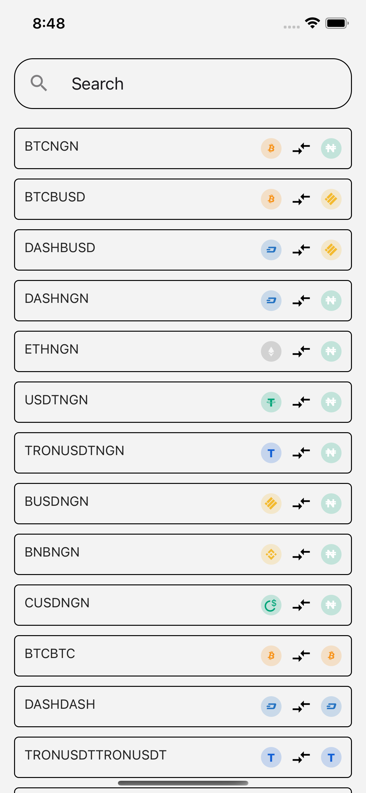
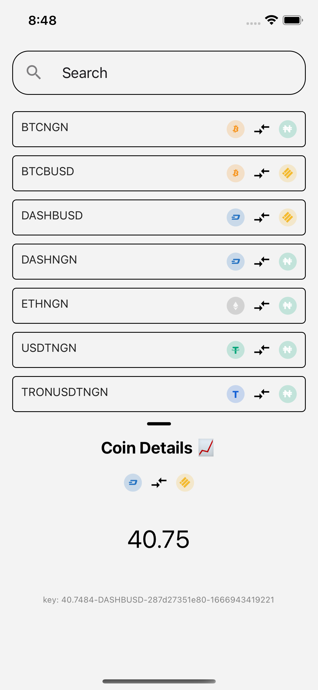
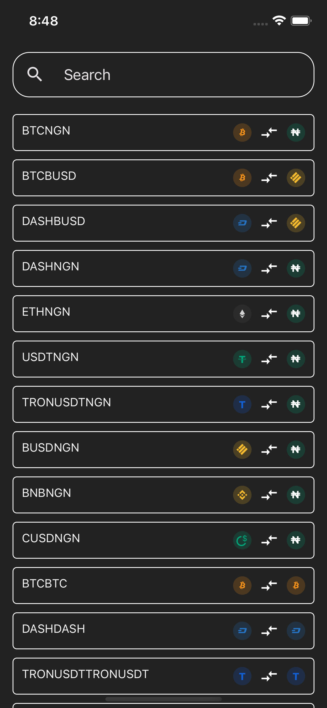
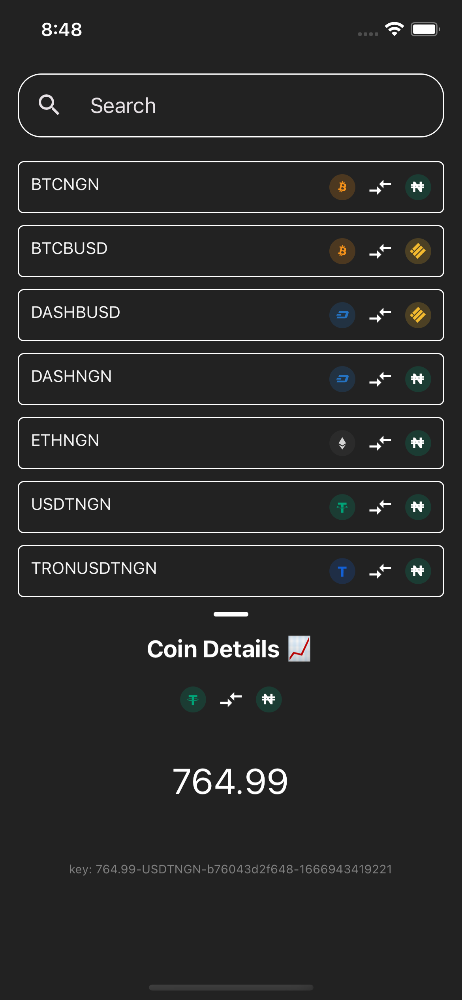

# Coin Profile using React Native

! !



A sample app implemented to show user a list of new coins and their detail.

## Getting Started

Before running this project please ensure React Native is installed and configured on your machine. If you're new to React Native, please checkout the [official guide](https://reactnative.dev/docs/environment-setup) with installation instructions for your OS.

This project is only configured to support the following platforms:

- Android
- iOS

Web and Desktop are not supported at this time.

After installing React Native and the necessary toolchain for your device (Android or iOS), connect your device or open your emulator before running the following:

**Clone the repo**

```bash
git clone https://github.com/Enigma-I-am/MyRNPriceTracker
```

**Open the app folder**

```bash
cd MyRNPriceTracker
```

**Install package dependencies:**

```bash
# Install npm dependencies
yarn

# Install pod dependencies
npx pod-install
```

**Run the project on your device or emulator:**

```bash
yarn ios # for iOS
yarn android # for android
```

**Run e2e test for iOS**

```bash
yarn e2e:test:ios # for iOS
yarn e2e:build:ios # for android
```
